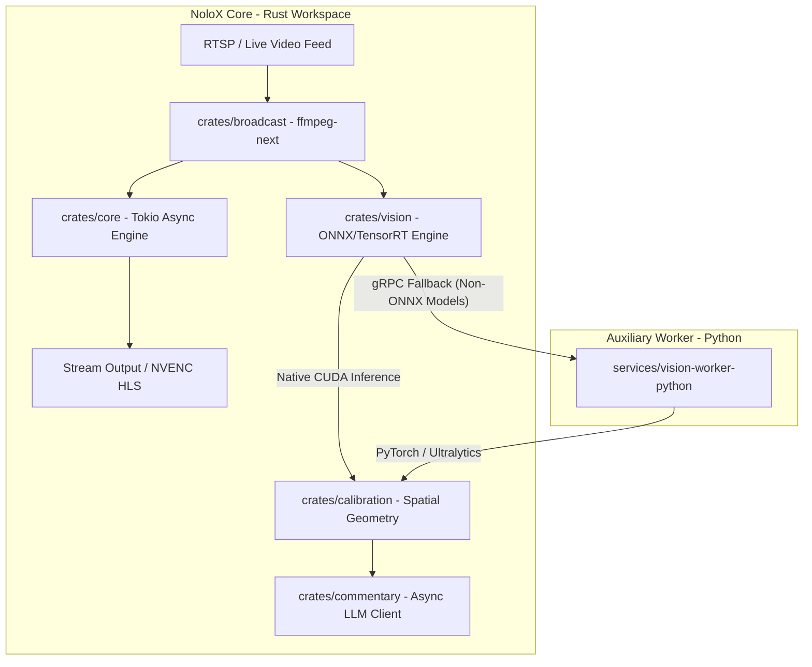

# NoloX

[](https://www.rust-lang.org/)
[](https://www.python.org/)
[](https://developer.nvidia.com/cuda-toolkit)
[](LICENSE)

**NoloX** is a high-performance, real-time video orchestration, media broadcasting, and Computer Vision inference engine. Built from the ground up to evolve legacy Go/shell-based pipelines, NoloX adopts a decoupled hybrid architecture: an asynchronous **Rust Core** for ultra-low latency media handling and native GPU inference (ONNX/TensorRT), backed by a secondary **Python Worker** (gRPC) for research-grade Deep Learning fallback.

---

## 🏛 Architecture

NoloX replaces legacy external shell script orchestration (`NOLO.sh`) and Go-based runtime GC overhead with a pure in-memory, thread-safe pipeline:



### Key Architectural Highlights

* **Zero Garbage Collection (GC) Latency**: Deterministic frame delivery and continuous video broadcasting without unpredictable runtime GC pauses.


* **Direct-on-GPU Inference**: Models converted to ONNX execute natively within the Rust process space via `ort` with CUDA/TensorRT acceleration.
* **Zero-Cost C/CUDA FFI**: Direct linkage with FFmpeg and graphics drivers without CGO context-switching overhead.


* **Ultra-Low Memory Footprint**: Less than 80 MB RAM usage for the primary core engine under full load.

---

## 📁 Monorepo Structure

```text
nolox/
├── Cargo.toml                   # Workspace configuration
├── crates/
│   ├── core/                    # Main engine, state orchestration, and APIs
│   ├── broadcast/               # Video stream management (FFmpeg, RTSP, NVENC)
│   ├── calibration/             # Linear algebra and spatial metrics (pixel -> meters)
│   ├── commentary/              # Async LLM integration for live commentary
│   └── vision/                  # Local ONNX Runtime inference engine (ort)
├── services/
│   └── vision-worker-python/    # Python gRPC worker (PyTorch/FastAPI) for fallback
├── proto/                       # Protobuf IPC contract definitions
├── docker/                      # CUDA-enabled Dockerfiles and static builds
└── docs/                        # Technical documentation and legacy mapping

```

---

## ⚡ Quick Start

### Prerequisites

* **Rust** (2021 edition) & `cargo`
* **Python** 3.11+ (with `uv` or `poetry`)
* **NVIDIA CUDA Toolkit** 12.0+ (with cuDNN and TensorRT)
* **FFmpeg** 6.0+ installed on system path

### 1. Building the Core (Rust)

```bash
# Clone repository
git clone [https://github.com/ThaysonScript/NoloX.git](https://github.com/ThaysonScript/NoloX.git)
cd NoloX

# Build workspace in release mode
cargo build --release

```

### 2. Setting Up Python Worker (Optional ML Fallback)

```bash
cd services/vision-worker-python

# Create virtual environment & install dependencies
uv venv
source .venv/bin/activate
uv pip install -r requirements.txt

# Start gRPC service
python server.py

```

---

## ⚙️ Configuration

NoloX is configured via `NoloX.toml` or environment variables:

```toml
[server]
host = "0.0.0.0"
port = 8080

[media]
rtsp_source = "rtsp://camera1.local:554/stream"
output_hls_path = "/var/www/stream/index.m3u8"
hardware_acceleration = "nvenc"

[vision]
engine = "native" # Options: "native" (Rust ONNX) or "python_fallback" (gRPC)
model_path = "models/yolov8n.onnx"
confidence_threshold = 0.5
cuda_device_id = 0

```

---

## 📊 Performance Benchmarks

#### Comming Soon

---

## 📜 License

Distributed under the **MIT License**. See `LICENSE` for details.
